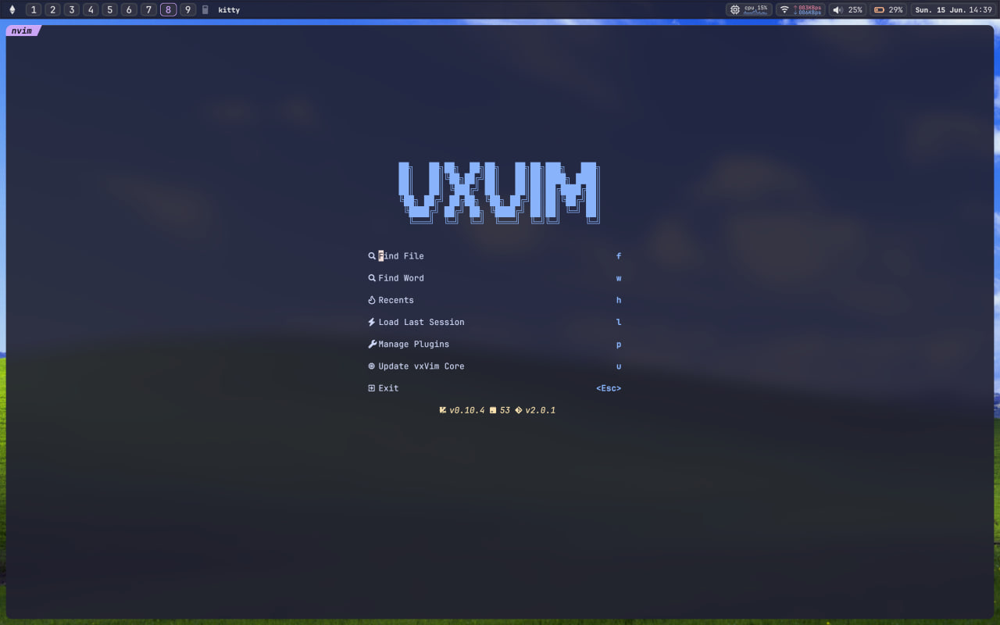
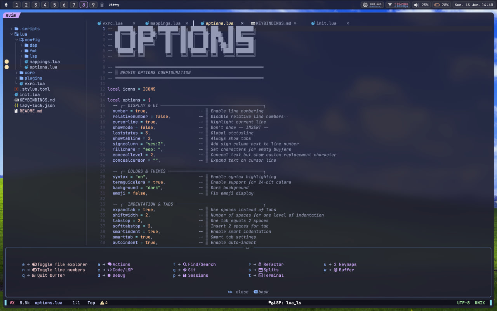

# 🚀 vxVim

> A clean, fast Neovim setup that just works






## ✨ What's Inside

- 🎨 **Clean Interface** - Catppuccin theme with transparency and nice colors
- 🔧 **Language Support** - LSP for 14+ languages with autocomplete and diagnostics
- 📁 **File Explorer** - NvimTree with git integration and smooth navigation
- 🔍 **Quick Search** - Telescope for finding files, text, and pretty much everything
- 🎯 **Smart Completion** - Autocomplete that actually helps while you code
- 🌳 **Syntax Highlighting** - TreeSitter makes your code look good and work better
- 🔄 **Easy Updates** - Update core components without breaking your personal setup
- ⚡ **Fast Startup** - Lazy loading means you're coding, not waiting
- 🎮 **Built-in Terminal** - Multiple terminal modes right in your editor
- 📝 **Auto Formatting** - Code gets formatted automatically when you save

## 📋 What You Need

- **Neovim** 0.9.0 or newer
- **Git** for installation and updates
- **Node.js** for some language servers
- **Python** for a few plugins
- **Go** for some tools
- A **Nerd Font** (JetBrains Mono works great)

## 🚀 Getting Started

### One-Line Install

```bash
bash <(curl -fsSL https://raw.githubusercontent.com/v88x/vxVim/main/.scripts/install.sh)
```

### Manual Setup

1. **Backup your current config:**
   ```bash
   mv ~/.config/nvim ~/.config/nvim.backup
   ```

2. **Clean the cache:**
   ```bash
   rm -rf ~/.local/share/nvim ~/.local/state/nvim ~/.cache/nvim
   ```

3. **Get vxVim:**
   ```bash
   git clone https://github.com/v88x/vxvim.git ~/.config/nvim
   ```

4. **Fire it up:**
   ```bash
   nvim
   ```

5. **Grab some coffee** - first startup takes a bit while plugins install

## 📁 How It's Organized

```
~/.config/nvim/
├── init.lua                # Entry point
├── KEYBINDINGS.md          # Complete key bindings reference
├── lua/
│   ├── vxrc.lua            # Main configuration
│   ├── config/
│   │   ├── options.lua     # Neovim options
│   │   ├── mappings.lua    # Key bindings
│   │   ├── fmt/            # Formatters
│   │   └── lsp/            # LSP configurations
│   ├── core/
│   │   ├── bootstrap.lua   # Plugin manager
│   │   ├── utils/          # Utilities & updater
│   │   └── plugins/        # Core plugins
│   └── plugins/
│       └── themes/         # Color themes
└── .scripts/
    └── install.sh          # Installation script
```

## 🔄 Staying Updated

vxVim checks for updates daily and only touches core files - your personal setup stays safe.

### How Updates Work

- **Smart Updates** - Only core components get updated, your customizations stay put
- **Dashboard Button** - Just press `u` in the dashboard when you see an update
- **Background Checks** - Happens automatically, won't bug you while coding
- **Your Stuff is Safe** - Personal configs, themes, and keybinds never get touched

### Update Commands

**From Inside Neovim:**
```vim
:VxVimUpdate         " Interactive update with confirmation
:VxVimCheckUpdates   " Check for available updates
```

**Keyboard Shortcuts:**
- `<leader>uu` - Update vxVim core
- `<leader>uc` - Check for updates
- `u` in dashboard - Quick update

**Pro tip:** Press `u` in the dashboard for the easiest update experience.

## ⚙️ Making It Yours

Everything you need to tweak is in `lua/vxrc.lua`:

```lua
VX = {
  leader = " ",
  
  ui = {
    colorscheme = "catppuccin",
    border = "rounded",
    transparent = true,
  },
  
  plugins = {
    highlight = {
      enable = true,
      indent = true,
      colors = true,
      autopairs = true,
    },
    
    tree = {
      git_hl = true,
      quit_on_open = false,
      width = 32,
      side = "left",
    },
    
    formatter = {
      format_on_save = true,
      timeout = 1000,
      async = true,
    },
    
    git = {
      signs = true,
      blame = true,
      blame_delay = 700,
    },
  },
}
```

## 🎨 Making Changes

### Adding Plugins

Drop a file in `lua/plugins/`:

```lua
-- lua/plugins/my-plugin.lua
return {
  "author/plugin-name",
  config = function()
    require("plugin-name").setup({
      -- your settings here
    })
  end,
}
```

### Custom Shortcuts

Edit `lua/config/mappings.lua`:

```lua
map("n", "<Leader>x", ":YourCommand<CR>", { desc = "What it does" })
```

### Different Theme

Change `lua/vxrc.lua`:

```lua
ui = {
  colorscheme = "your-favorite-theme",
  transparent = false,
}
```

## 🎯 Keyboard Shortcuts

Hit `<Space>` and see what happens - everything's organized into neat groups.

### Quick Reference

| Category | Leader Prefix | Examples |
|----------|---------------|----------|
| **Files & Buffers** | `<Leader>w`, `<Leader>e` | `<Leader>ww` (save), `<Leader>e` (file tree) |
| **Search & Find** | `<Leader>f` | `<Leader>ff` (files), `<Leader>fg` (grep) |
| **Code & LSP** | `<Leader>c`, `g` | `<Leader>ca` (actions), `gd` (definition) |
| **Git** | `<Leader>g` | `<Leader>gd` (diff), `<Leader>gS` (status) |
| **Terminal** | `<Leader>t` | `<Leader>tf` (float), `<Leader>th` (horizontal) |
| **Debug** | `<Leader>d` | `<Leader>dd` (UI), `<Leader>db` (breakpoint) |
| **Sessions** | `<Leader>p` | `<Leader>psl` (load), `<Leader>pss` (save) |

### Dashboard Keys
- `f` - Find files
- `w` - Search text  
- `h` - Recent files
- `l` - Load last session
- `p` - Manage plugins
- `u` - **Update vxVim core**
- `<Esc>` - Exit

### The Basics
- `jk` - Get out of insert mode (way better than Escape)
- `<Tab>` / `<S-Tab>` - Jump between open files
- `<C-h/j/k/l>` - Move between windows
- `<C-i>` - Comment/uncomment lines

📖 **[See all shortcuts →](KEYBINDINGS.md)**

## 🔧 Language Support

Works out of the box with:

| Language | LSP Server |
|----------|------------|
| **Lua** | lua_ls |
| **Python** | pyright |
| **JavaScript/TypeScript** | vtsls |
| **Go** | gopls |
| **C/C++** | clangd |
| **Rust** | rust_analyzer |
| **JSON** | jsonls |
| **HTML** | html |
| **CSS** | cssls |
| **Bash** | bashls |
| **CMake** | cmake |
| **SQL** | sqls |
| **C#** | omnisharp |
| **Tailwind** | tailwindcss |

## 📄 License

GNU GPL v3.0 License - see [LICENSE](LICENSE) file for details.

## 🙏 Thanks To

- [Neovim](https://neovim.io/) - For being awesome
- [Lazy.nvim](https://github.com/folke/lazy.nvim) - Best plugin manager
- [Catppuccin](https://github.com/catppuccin/nvim) - Beautiful colors
- All the plugin creators who make this possible

---

<div align="center">
  <strong>Built for developers who want things to just work</strong>
</div> 
